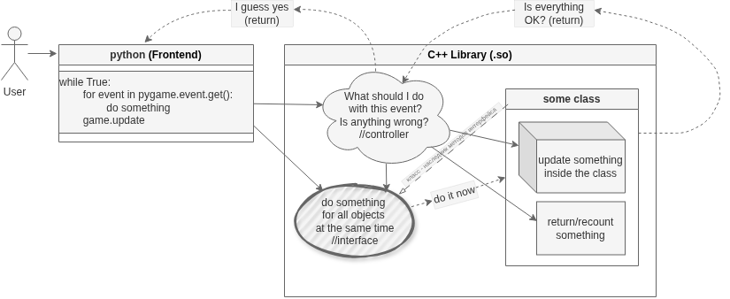

# lab2-TIDI25

<del> Idea:
бильярд где шары могут притягиваться/отталкиваться или бильярд со крайне тяжелыми шарами (возможно с планетами солнечной системы, тогда это 9-ball)</del>

 ---

текущая проблема с физикой - на высокой скорости шары проходят сквозь друг друга. хочу ли я это исправлять за два дня до экзамена? - нет.

похоже исправлять физику все же придется... 
 ---
шаг 1. написать обычную 9-ball версию ✅
---
обновление не явно зависит времени
скорее всего это все будет в пределах основного класса, где питон вместо времени пересчитает шаги анимации

т.е.    
#где-то в main.py
FPS = 60 //или get_FPS_from_system
game = New Game(FPS)

//где-то в контроллере в C++
set animation_step = FPS

#где-то в main.py привязать update к обновлению экрана 

у update и game должно быть больше случаев (т.к. это библиотека, кто вообще читает документацию к бибилотекам?)     
update() //всегда на 1 шаг  
update(steps)   

game(int animation_steps) //если у нас шаги анимации    
game() //если шагов нет, то мы считаем кадры по времени     
game(time) //если шагов нет, то мы считаем кадры по времени     
//тут game это экземпляр контроллера    

и для такого фокуса тоже нужно исправить физику.... 

---
контроллер 

? (это вообще проблема контроллера?) понять где тут начало, а где конец координат (вдруг эту библиотеку запускает в на чем-то где 0, 0 это центр или левый нижний угол или правый верхний, моя библиотека вообще хз кто и где её запускает) 

---
шаг 2 - [оптимизация](#pybind11-comment)
---
шаг 3 - всмонить о сроках сдачи, забыть про идею, оставить 9-ball с багами ✅
---

pip install pygame  
g++ -shared -fPIC -o libgame.so controller.cc game.cc  
python main.py

---

я не считаб эту схему архитектурой классов
---
ТЗ:

### 1. Реализовать игру
Требование | Описание | Статус
-----------|----------|-------
Реализовать игру | Реализовать игру, например клеточный автомат "Игра Жизнь" | ✅

### 2. Обязательные технические требования (C++)
Требование | Описание | Статус
-----------|----------|-------
Интерфейсы | В программе должен быть минимум один абстрактный класс (чисто виртуальные методы) | ✅
Наследование | Должна быть реализована иерархия классов (наследники реализуют интерфейс) | ✅
Перегрузка | Использовать перегрузку методов или операторов (например, оператор вывода << или индексации []) | ❌

чисто формально, перегрузки тут есть (но фактически они бесполезны на данный момент)
Требование | Описание | Статус
-----------|----------|-------
Управление памятью | Использовать умные указатели (std::unique_ptr, std::shared_ptr) | ✅
### 3. Дополнительные требования (для высокого балла)
Требование | Описание | Статус
-----------|----------|-------
Полиморфизм | Написать функцию или метод, которая принимает на вход объект через интерфейс (базовый класс) | ✅
Связка C++ и Python | Логика игры пишется на C++, код компилируется в динамическую библиотеку (.so файл) | ✅
Pybind11 Wrapper | Используется библиотека pybind11 для создания обертки (wrapper) | ❌

черт.... можно было использовать pybind11... можно. было. использовать. pybind11. надеюсь я не забуду переписать EXTERN C: в  pybind11 (ещё бы использовать тут указатели, а не копирование)

Требование | Описание | Статус
-----------|----------|-------
Документация | Нарисовать схему архитектуры классов (например, в draw.io) | ❌

---
P.s. если я хочу красивые галочки, то я найду красивые галочки. (галочки нагло похищены у [yusufklncc](https://github.com/yusufklncc))
