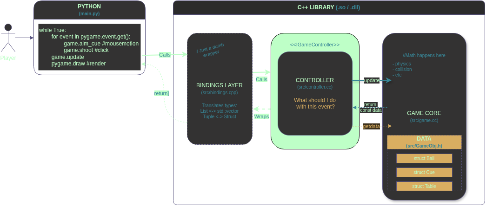

# lab2-TIDI25
9-ball (pocket billiards)
---

### Установка зависимостей
```bash
pip install pygame pybind11
```
### Сборка проекта
```bash
python build.py
```

### Запуск игры
```bash
python main.py
```

---
project architecture:


---
ТЗ:

### 1. Реализовать игру
Требование | Описание | Статус
-----------|----------|-------
Реализовать игру | Реализовать игру, например клеточный автомат "Игра Жизнь" | ✅

### 2. Обязательные технические требования (C++)
Требование | Описание | Статус
-----------|----------|-------
Интерфейсы | В программе должен быть минимум один абстрактный класс (чисто виртуальные методы) | ✅
Наследование | Должна быть реализована иерархия классов (наследники реализуют интерфейс) | ✅
Перегрузка | Использовать перегрузку методов или операторов (например, оператор вывода << или индексации []) | ✅
Управление памятью | Использовать умные указатели (std::unique_ptr, std::shared_ptr) |  ✅
### 3. Дополнительные требования (для высокого балла)
Требование | Описание | Статус
-----------|----------|-------
Полиморфизм | Написать функцию или метод, которая принимает на вход объект через интерфейс (базовый класс) |  ✅
Связка C++ и Python | Логика игры пишется на C++, код компилируется в динамическую библиотеку (.so файл) |  ✅
Pybind11 Wrapper | Используется библиотека pybind11 для создания обертки (wrapper) |  ✅
Документация | Нарисовать схему архитектуры классов (например, в draw.io) |  ✅

Не тз;
Требование | Описание | Статус
-----------|----------|-------
Физика | Физика должна быть исправлена | ❌
Идея | Изначальная идея была сложнее...  | ❌
---
P.s. если я хочу красивые галочки, то я найду красивые галочки. (галочки нагло похищены у [yusufklncc](https://github.com/yusufklncc))  
P.s.s. перегрузки конструктора и update существуют, но не используються, поэтому перегрузок пока нет 

---
old draft of the project architecture:


План по исправлению физики 
1. <del>сделать формулы читаемыми используя constexpr или отдельный класс/cструктуру (пока отдельный, для отладки)
2. исправить физику сталкновений (очень много бесполезных проверок, а шары все ещё проходят сквозь друг друга)
3. исправить update (steps)
4. исправить отражание от бортиков (да оно работает, и работает хорошо, но, возможно если скорость будет выше, а ф-ии будут зависить от шагов, то они начнут пролетать сквозь бортики)
5. переписать в constexpr действия над векторами    
5.1 обновить drawio     
6.1. проверить доступ к шарам (нужна ли что-то менять?) 
6.2. исправить цвета    
7. потестить перегрузки контроллера     
