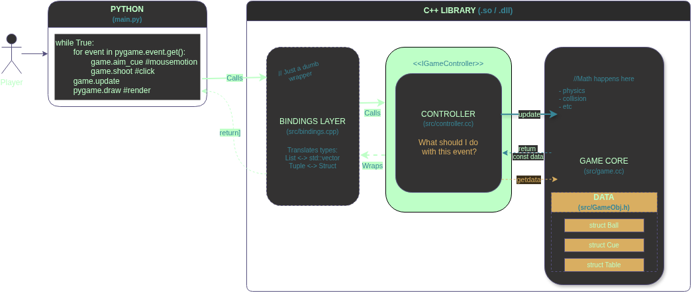

# lab2-TIDI25
9-ball (pocket billiards)
---

### Установка зависимостей
```bash
pip install pygame pybind11
```
### Сборка проекта
```bash
python build.py
```

### Запуск игры
```bash
python main.py
```

---
### Запуск в Docker (кроссплатформенно)
GUI (pygame) запускается внутри контейнера и отдаётся через noVNC в браузер.

```bash
docker compose up --build
```

Откройте в браузере: `http://localhost:6080/vnc.html`  
Пароль по умолчанию: `pool` (можно переопределить `VNC_PASSWORD`).

Опционально можно подключиться VNC-клиентом к `localhost:5901`.

---
project architecture:


---
ТЗ:
### 1. Реализовать игру
Требование | Описание | Статус
-----------|----------|-------
Реализовать игру | Реализовать игру, например клеточный автомат "Игра Жизнь" | ✅

### 2. Обязательные технические требования (C++)
Требование | Описание | Статус
-----------|----------|-------
Интерфейсы | В программе должен быть минимум один абстрактный класс (чисто виртуальные методы) | ✅
Наследование | Должна быть реализована иерархия классов (наследники реализуют интерфейс) | ✅
Перегрузка | Использовать перегрузку методов или операторов (например, оператор вывода << или индексации []) | ✅
Управление памятью | Использовать умные указатели (std::unique_ptr, std::shared_ptr) |  ✅
### 3. Дополнительные требования (для высокого балла)
Требование | Описание | Статус
-----------|----------|-------
Полиморфизм | Написать функцию или метод, которая принимает на вход объект через интерфейс (базовый класс) |  ✅
Связка C++ и Python | Логика игры пишется на C++, код компилируется в динамическую библиотеку (.so файл) |  ✅
Pybind11 Wrapper | Используется библиотека pybind11 для создания обертки (wrapper) |  ✅
Документация | Нарисовать схему архитектуры классов (например, в draw.io) |  ✅
